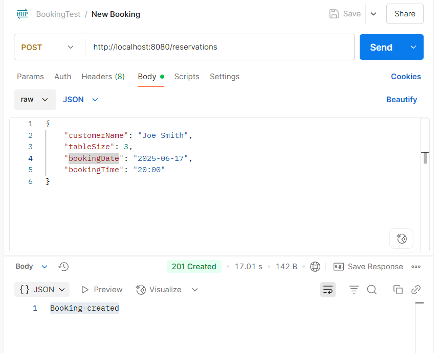
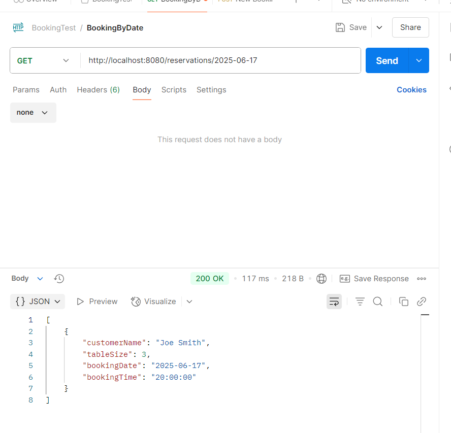
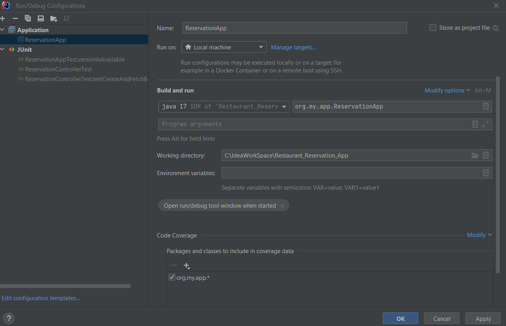

# MyRestaurantReservation
Restaurant booking application

This project is a restaurant reservation system that allows users to request booking at restaurant and owner to view bookings by date. 

## Features
- User can request a booking at a restaurant
  - User can post a JSON requst to the API with booking details: i.e., from Postman, sending request like below
  - 
- Owner can view bookings by date
  - Owner can view bookings by restaurant by a GET request like below:
  - 

## Technologies Used
- Java 17
- MuleServer 2.1.8
- Jackson-Databind 2.15
- Junit 5
- Maven 3

## How to Run
This is standalone application, you can run it by command line or using your favorite IDE.
i.e., below is the run configuration for IntelliJ IDEA:

Or run in command line with packaged jar:
java -jar RestaurantReservation-1.0.0-SNAPSHOT.jar

## How to Test
1. Junit tests are provided in the `src/test/java` directory, especially for the Controller ReservationHandler
2. Postman tool can be used for testing the API endpoints
   - refer to above attached postman requests screen snapshot

## Application Design 
Application Design follows the MVC pattern (View is not required), with the following components:
- **model**: Contains the data structure for Booking, Table and Response based on Java 17 Record
- **controller**: Contains the ReservationHandler which handles the API requests
- **service**: Contains the booking service which includes the business logic for handling bookings
- **repository**: Using in-memory data structure ConcurrentHashMap for storing bookings and tables, can be enhanced to use JPA and database
- **exception**: exceptions handling included, can be enhanced to use customerized more user friendly exceptions

## Resources and Configuration
  Contains a `resources` directory with the following:
- `application.properties`: Contains the configuration for the application, such as port number and other settings.
- `logback.xml`: Contains the configuration for logging, such as log level and log file location.
- `tableConfiguration.json`: Contains the JSON configuration for Tables, which is used to generate the runtime valid tables for booking condition check.